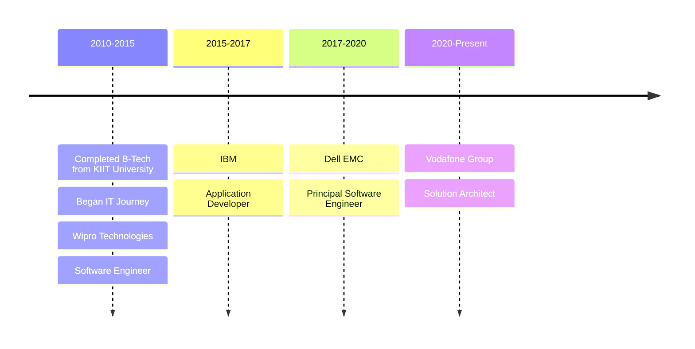

### 🤝🏻 Greetings

Hello there! As an architect, I specialize in designing and developing enterprise-level software applications that cater to the unique needs of businesses. I place great emphasis on creating scalable and secure solutions that address the specific needs of corporate clients. I hold a deep-seated appreciation for open-source technologies, which offer a collaborative and inclusive approach to software development. I believe that leveraging the principles of open-source can promote innovation, knowledge-sharing, and better outcomes for clients.

### 📫 How to reach me
If you are curious, here's where you can find me:

 1. [GitHub](https://github.com/sumitsahoo) (I am guessing you are already here 😂)
 2. [X](https://x.com/sumitsahoo)
 3. [Medium](https://medium.com/@sumitsahoo)
 4. <a rel="me" href="https://mastodon.social/@sumitsahoo">Mastodon</a>
 5. [Bluesky](https://bsky.app/profile/sumitsahoo.bsky.social)
 6. [LinkedIn](https://www.linkedin.com/in/sumit-sahoo)
 7. [StackOverflow](https://stackoverflow.com/users/1293601/sumit-sahoo)
 8. [Team-BHP](https://www.team-bhp.com/forum/members/newenergy.html) (I occasionally write stuff about cars 🚗)
 
### 🔭 What I am up-to now ?
I am currently experimenting with a range of innovative technologies, such as LLMs (using Langchain, Llama-Index, and Enterprise data ahem ahem ...), GCP, AWS Amplify, Docker, and Strapi CMS. Additionally, I am exploring the capabilities of my shiny new Raspberry Pi 5.

### 📱 Apps developed by me
Well, mostly I architect the solution and develop enterprise based apps. So unless you work for same company as I do, you won't be able to view all the apps that I was involved in. You can still see a few that I developed as a hobby:  [Personal Play Store Account](https://play.google.com/store/apps/developer?id=Sumit%20Sahoo)

### 💼 Work history

Let me summarise in mermaid 😅

### 📈 My GitHub stats

