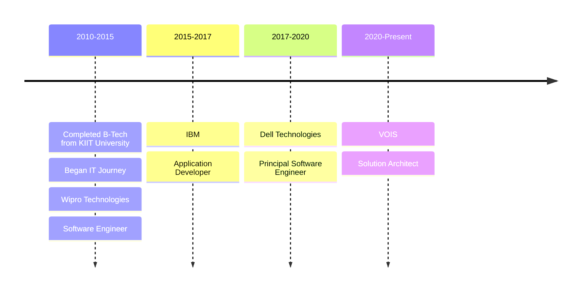

## 👨‍💻 About Me

> Architect specializing in **enterprise-level software** — designing **scalable, secure solutions** with a deep appreciation for **open-source technologies**.

- 🔭 Currently building **AI Agents** and cloud-native **enterprise applications**
- 💬 Ask me about **System Design, Cloud Architecture, AI/ML**
- 🌱 Always learning and exploring new technologies
- ⚡ Fun fact: I love cars and follow Team-BHP! 🚗

## 🛠️ Tech Stack

> **🤖 AI & Agentic Frameworks**

> **💻 Programming Languages**

> **📱 Web & Mobile**

> **☁️ Infrastructure & Cloud**

## 🔗 Connect With Me

## 📈 Activity

## 📚 Latest Medium Stories

- 📸 [Introducing Modern Barcode Scanner: The Only React Barcode Library You'll Ever Need](https://medium.com/@sumitsahoo/introducing-modern-barcode-scanner-the-only-react-barcode-library-youll-ever-need-5f603feb7631)
- 🍏 [How to Install macOS Tahoe via USB Drive](https://medium.com/@sumitsahoo/how-to-install-macos-tahoe-via-usb-drive-4308e70269dc)
- 🎬 [Stable Video Diffusion with Replicate](https://medium.com/@sumitsahoo/stable-video-diffusion-with-replicate-7bdd3ff3879e)
- 📊 [Generate Charts using OpenAI Code Interpreter](https://medium.com/@sumitsahoo/generate-charts-using-openai-code-interpreter-88cb93a06da0)
- 💻 [Must-have tools and apps for macOS in 2025](https://medium.com/@sumitsahoo/must-have-tools-and-apps-for-macos-for-developers-in-2023-6cc43dd83bcc)

## 🚀 Featured Projects

### [CloakPDF](https://pdf.cloakyard.com/) — A powerful, fully open-source PDF toolkit

> Merge, split, compress, convert, and more — all running locally in your browser. No uploads, no servers, no limits.

### [CloakResume](https://resume.cloakyard.com/) — A privacy-first, open-source resume builder

> Craft beautiful, professional resumes entirely in your browser. Your data never leaves your device.

## 📦 NPM Packages

I occasionally publish npm packages that I think will help others. I love open source and believe in giving back to the community!

| Package | Downloads |
| :--- | :--- |
| [web-haptic-engine](https://www.npmjs.com/package/web-haptic-engine) |  |
| [modern-barcode-scanner](https://www.npmjs.com/package/modern-barcode-scanner) |  |
| [detect-primary-camera](https://www.npmjs.com/package/detect-primary-camera) |  |

## 💼 Career Journey

```mermaid
timeline
    2010-2015 : Completed B-Tech from KIIT University : Began IT Journey : Wipro Technologies : Software Engineer
    2015-2017 : IBM : Application Developer
    2017-2020 : Dell Technologies : Principal Software Engineer
    2020-Present : VOIS : Solution Architect
```

### Thanks for visiting!

_P.S. — You scrolled all the way down? Here's a snake eating my contribution graph as a reward._

