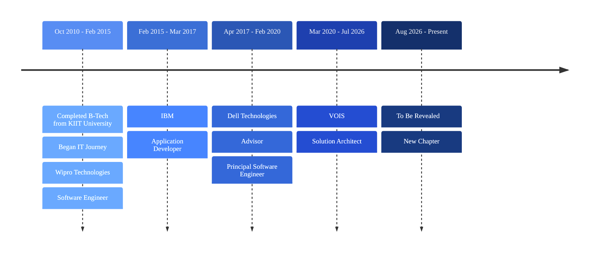

## 👨‍💻 About Me

> Architect specializing in **enterprise-level software** — designing **scalable, secure solutions** with a deep appreciation for **open-source technologies**.

- 🔭 Currently building **AI Agents** and cloud-native **enterprise applications**
- 💬 Ask me about **System Design, Cloud Architecture, AI/ML**
- 🌱 Always learning and exploring new technologies
- ⚡ Fun fact: I love cars and follow Team-BHP! 🚗

## 🛠️ Tech Stack

<table>
  <tr>
    <td><b>🤖 AI &amp; Agentic Frameworks</b></td>
    <td>      <a href="#"><img alt="Langfuse" src="https://img.shields.io/badge/Langfuse-FF5D5F?style=flat&logo=&logoColor=white" /></a>       </td>
  </tr>
  <tr>
    <td><b>💻 Programming Languages</b></td>
    <td>     </td>
  </tr>
  <tr>
    <td><b>📱 Web &amp; Mobile</b></td>
    <td>     </td>
  </tr>
  <tr>
    <td><b>☁️ Infrastructure &amp; Cloud</b></td>
    <td>     </td>
  </tr>
</table>

## 🔗 Connect With Me

## 📈 Activity

## 📚 Latest Medium Stories

- 📸 [Introducing Modern Barcode Scanner: The Only React Barcode Library You'll Ever Need](https://medium.com/@sumitsahoo/introducing-modern-barcode-scanner-the-only-react-barcode-library-youll-ever-need-5f603feb7631)
- 🍏 [How to Install macOS Tahoe via USB Drive](https://medium.com/@sumitsahoo/how-to-install-macos-tahoe-via-usb-drive-4308e70269dc)
- 🎬 [Stable Video Diffusion with Replicate](https://medium.com/@sumitsahoo/stable-video-diffusion-with-replicate-7bdd3ff3879e)
- 📊 [Generate Charts using OpenAI Code Interpreter](https://medium.com/@sumitsahoo/generate-charts-using-openai-code-interpreter-88cb93a06da0)
- 💻 [Must-have tools and apps for macOS in 2025](https://medium.com/@sumitsahoo/must-have-tools-and-apps-for-macos-for-developers-in-2023-6cc43dd83bcc)

## 🚀 Featured Projects

### [CloakPDF](https://pdf.cloakyard.com/) — A powerful, fully open-source PDF toolkit

> Merge, split, compress, convert, and more — all running locally in your browser. No uploads, no servers, no limits.

### [CloakResume](https://resume.cloakyard.com/) — A privacy-first, open-source resume builder

> Craft beautiful, professional resumes entirely in your browser. Your data never leaves your device.

### [CloakImg](https://img.cloakyard.com/) — A minimal, privacy-first photo editor

> A clean, browser-based photo editor that respects your photos. Crop, adjust, and enhance — everything stays on your device.

## 📦 NPM Packages

I occasionally publish npm packages that I think will help others. I love open source and believe in giving back to the community!

| Package | Downloads |
| :--- | :--- |
| [web-haptic-engine](https://www.npmjs.com/package/web-haptic-engine) |  |
| [modern-barcode-scanner](https://www.npmjs.com/package/modern-barcode-scanner) |  |
| [detect-primary-camera](https://www.npmjs.com/package/detect-primary-camera) |  |

## 💼 Career Journey

```mermaid
%%{init: {'theme':'base', 'themeVariables': {
  'cScale0':'#588DF3','cScaleLabel0':'#ffffff',
  'cScale1':'#3B6FD6','cScaleLabel1':'#ffffff',
  'cScale2':'#2B57B5','cScaleLabel2':'#ffffff',
  'cScale3':'#1E40AF','cScaleLabel3':'#ffffff',
  'cScale4':'#14306B','cScaleLabel4':'#ffffff',
  'cScaleInv0':'#588DF3','cScaleInv1':'#3B6FD6','cScaleInv2':'#2B57B5',
  'cScaleInv3':'#1E40AF','cScaleInv4':'#14306B',
  'lineColor':'#64748B','fontFamily':'Segoe UI, Helvetica, Arial, sans-serif'
}}}%%
timeline
    Oct 2010 - Feb 2015 : Completed B-Tech from KIIT University : Began IT Journey : Wipro Technologies : Software Engineer
    Feb 2015 - Mar 2017 : IBM : Application Developer
    Apr 2017 - Feb 2020 : Dell Technologies : Advisor : Principal Software Engineer
    Mar 2020 - Jul 2026 : VOIS : Solution Architect
    Aug 2026 - Present : To Be Revealed 🤫 : New Chapter
```

### Thanks for visiting!

_P.S. — You scrolled all the way down? Here's a snake eating my contribution graph as a reward._

