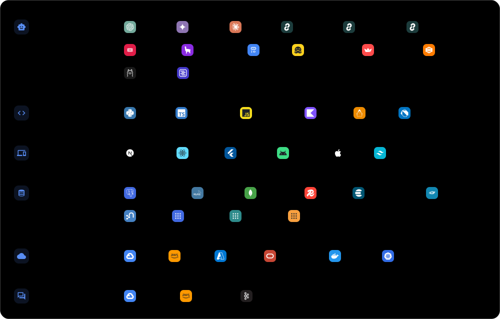
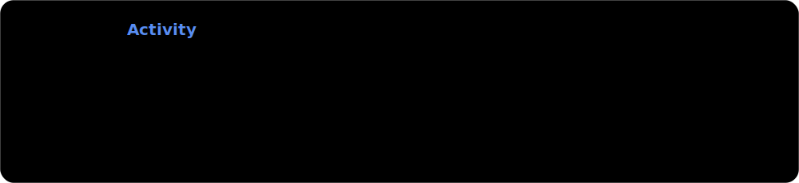
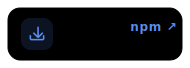
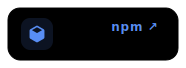
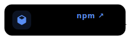
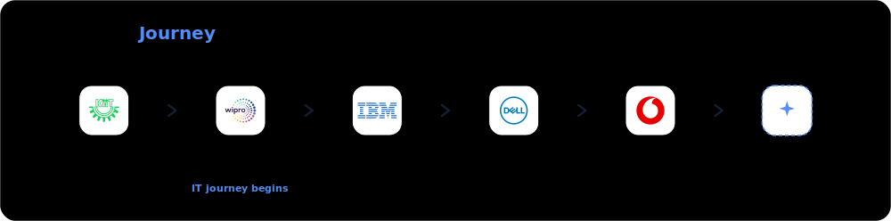

<!-- Hidden 1px counter: keeps komarev incrementing on real profile visits.
     The live value is shown in the "Profile Views" chip above (refreshed by the weekly workflow). -->

## 👨‍💻 About Me

> I'm a solution architect. By day I design enterprise systems that need to scale and stay secure. The rest of the time I'm building open-source tools because I genuinely enjoy it.

- 🔭 Currently building AI agents and cloud-native apps at work
- 💬 Ask me about system design, cloud architecture, or AI/ML
- 🌱 Usually have a side project or two on the go
- 🚗 Off the clock I'm a car guy — mostly lurking on Team-BHP

## 🛠️ Tech Stack

_My usual go-tos, not the full list. I'll happily pick up whatever a project needs._

## 🔗 Connect With Me

## 📈 GitHub Activity

## 📚 Latest Medium Stories

- 📸 [Introducing Modern Barcode Scanner: The Only React Barcode Library You'll Ever Need](https://medium.com/@sumitsahoo/introducing-modern-barcode-scanner-the-only-react-barcode-library-youll-ever-need-5f603feb7631)
- 🍏 [How to Install macOS Tahoe via USB Drive](https://medium.com/@sumitsahoo/how-to-install-macos-tahoe-via-usb-drive-4308e70269dc)
- 🎬 [Stable Video Diffusion with Replicate](https://medium.com/@sumitsahoo/stable-video-diffusion-with-replicate-7bdd3ff3879e)
- 📊 [Generate Charts using OpenAI Code Interpreter](https://medium.com/@sumitsahoo/generate-charts-using-openai-code-interpreter-88cb93a06da0)
- 💻 [Must-have tools and apps for macOS in 2025](https://medium.com/@sumitsahoo/must-have-tools-and-apps-for-macos-for-developers-in-2023-6cc43dd83bcc)

## 🚀 Featured Projects

### [CloakPDF](https://pdf.cloakyard.com/) — an open-source PDF toolkit

> Merge, split, compress, convert, and more, all in your browser. Nothing ever gets uploaded.

### [CloakResume](https://resume.cloakyard.com/) — a privacy-first resume builder

> Put together a clean resume right in your browser. Your data stays on your device.

### [CloakImg](https://img.cloakyard.com/) — a lightweight photo editor

> Crop, adjust, and touch up photos right in the browser. They never leave your device.

## 📦 NPM Packages

A few small npm packages I've put out over the years. If one of them saves you some time, that's the whole point.

## 💼 Career Journey

### Thanks for visiting!

_P.S. — You scrolled all the way down? Here's a snake eating my contribution graph as a reward._

